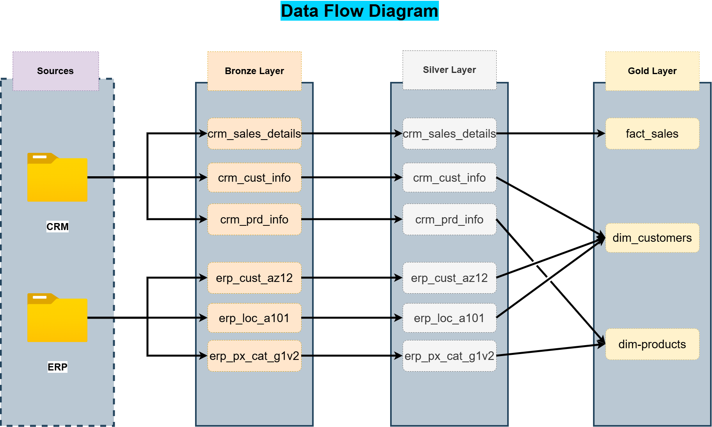

# 📊 Data Warehouse & Analytics Project

Modern SQL Server data warehouse implementing Medallion Architecture for scalable ETL pipelines, data transformation, and analytics-ready reporting.

---

# 🚀 Project Overview

This project demonstrates the end-to-end implementation of a production-style data warehouse using SQL Server.

The warehouse integrates data from multiple source systems, processes it through layered transformations, and delivers analytics-ready models for reporting and business intelligence.

Architecture implemented:

* Bronze Layer → Raw ingestion
* Silver Layer → Cleansed and standardized data
* Gold Layer → Business-ready analytical models

---

# 🏗️ Architecture


## Medallion Architecture


### 🥉 Bronze Layer

Raw ingestion layer that stores source data with minimal transformation.

Responsibilities:

* Load CRM and ERP CSV files
* Preserve raw source structure
* Maintain source-level traceability

---

### 🥈 Silver Layer

Transformation layer for cleansing and standardization.

Responsibilities:

* Data cleaning
* Null handling
* Deduplication
* Standardization
* Validation

---

### 🥇 Gold Layer

Analytics layer optimized for reporting and business insights.

Responsibilities:

* Fact and dimension modeling
* Star schema design
* Analytics-ready datasets

---

# 📂 Repository Structure

```bash
data-warehouse-project/
│
├── datasets
│   ├── source_crm
│   │   ├── cust_info.csv
│   │   ├── prd_info.csv
│   │   └── sales_details.csv
│   │
│   └── source_erp
│       ├── CUST_AZ12.csv
│       ├── LOC_A101.csv
│       └── PX_CAT_G1V2.csv
│
├── docs
│   ├── data_catalog.md
│   ├── data_flow.png
│   ├── data_model.png
│   ├── dw_architecture.png
│   ├── integration_model.png
│   ├── master.drawio
│   └── naming_conventions.md
│
├── scripts
│   ├── bronze
│   │   ├── ddl_bronze.sql
│   │   └── proc_load_bronze.sql
│   │
│   ├── silver
│   │   ├── ddl_silver.sql
│   │   └── proc_load_silver.sql
│   │
│   ├── gold
│   │   └── ddl_gold.sql
│   │
│   ├── raw_practice_scripts
│   │   ├── gold_dim_products.sql
│   │   ├── silver_crm_cust_info.sql
│   │   ├── silver_crm_prd_info.sql
│   │   ├── silver_crm_sales_details.sql
│   │   ├── silver_erp_cust_az12.sql
│   │   ├── silver_erp_loc_a101.sql
│   │   └── silver_erp_px_cat_g1v2.sql
│   │
│   └── init_database.sql
│
└── tests
    ├── quality_checks_gold.sql
    └── quality_checks_silver.sql
```

---

# 📊 Source Systems

## CRM Source

Contains:

* Customer information
* Product details
* Sales transactions

Files:

* `cust_info.csv`
* `prd_info.csv`
* `sales_details.csv`

---

## ERP Source

Contains:

* Customer reference data
* Location mapping
* Product category mapping

Files:

* `CUST_AZ12.csv`
* `LOC_A101.csv`
* `PX_CAT_G1V2.csv`

---

# 🔄 Warehouse Execution Flow



## 1️⃣ Initialize Database

Run:

```sql
:r scripts/init_database.sql
```

Purpose:

* Create database
* Create schemas
* Initialize warehouse environment

---

## 2️⃣ Create Bronze Layer Tables

Run:

```sql
:r scripts/bronze/ddl_bronze.sql
```

Purpose:

* Create raw staging tables
* Prepare Bronze ingestion layer

---

## 3️⃣ Load Bronze Layer

Create Procedure:

```sql
:r scripts/bronze/proc_load_bronze.sql
```

Execute:

```sql
EXEC bronze.load_bronze;
```

Purpose:

* Load CRM and ERP CSV files
* Populate Bronze tables

---

## 4️⃣ Create Silver Layer Tables

Run:

```sql
:r scripts/silver/ddl_silver.sql
```

Purpose:

* Create cleaned and standardized tables

---

## 5️⃣ Load Silver Layer

Create Procedure:

```sql
:r scripts/silver/proc_load_silver.sql
```

Execute:

```sql
EXEC silver.load_silver;
```

Purpose:

* Transform Bronze data
* Clean and standardize records
* Apply validations

---

## 6️⃣ Create Gold Layer

Run:

```sql
:r scripts/gold/ddl_gold.sql
```

Purpose:

* Create fact and dimension tables
* Build analytics-ready models

---

# 🧪 Data Quality Checks

Validation scripts included for:

* Null validation
* Duplicate detection
* Referential integrity checks
* Data consistency verification

Scripts:

```bash
tests/
├── quality_checks_gold.sql
└── quality_checks_silver.sql
```

---

# 🛠️ Technology Stack

| Category        | Technology                   |
| --------------- | ---------------------------- |
| Database        | SQL Server Express           |
| Language        | T-SQL                        |
| IDE             | SQL Server Management Studio |
| Version Control | Git & GitHub                 |
| Documentation   | Markdown                     |
| Diagramming     | Draw.io                      |

---

# 📈 Concepts Demonstrated

* ETL Pipeline Development
* Data Warehousing
* Medallion Architecture
* Star Schema Modeling
* Stored Procedures
* Data Cleansing
* Data Validation
* SQL Transformation Logic
* Analytical Modeling

---

# 📚 Documentation

| File                    | Description                   |
| ----------------------- | ----------------------------- |
| `data_catalog.md`       | Metadata and schema reference |
| `data_flow.png`         | ETL pipeline flow             |
| `data_model.png`        | Data model diagram            |
| `dw_architecture.png`   | Warehouse architecture        |
| `integration_model.png` | Source integration mapping    |
| `naming_conventions.md` | SQL naming standards          |

---

# ⚡ Setup

Clone repository:

```bash
git clone https://github.com/Code-X-Slayer/data-warehouse-project.git
cd data-warehouse-project
```

---

# 📊 Pipeline Flow

```text
CRM / ERP Sources
        ↓
Bronze Layer
(Raw Data)
        ↓
Silver Layer
(Cleansed Data)
        ↓
Gold Layer
(Analytics Models)
```

---

# 🔗 Links

* GitHub: [Code-X-Slayer GitHub](https://github.com/Code-X-Slayer?utm_source=chatgpt.com)
* Repository: [Data Warehouse Project Repository](https://github.com/Code-X-Slayer/data-warehouse-project?utm_source=chatgpt.com)
* Portfolio: [Portfolio Website](https://vijay-karthik.vercel.app?utm_source=chatgpt.com)

---

# 📄 License

MIT License
